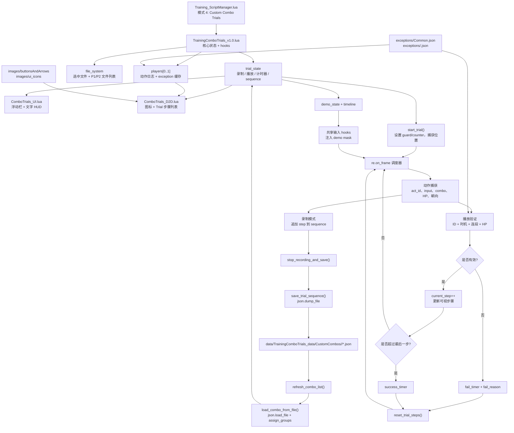

# 架构说明

这个目录是一套基于 REFramework 的 Street Fighter 6 训练脚本。Custom Combo Trials 功能主要由以下文件组成：

- `autorun/TrainingComboTrials_v1.0.lua`：核心状态、录制、读取、验证、保存/加载、游戏 Hook、快捷键、Demo 播放。
- `autorun/func/ComboTrials_UI.lua`：ImGui 菜单、浮动控制栏、文字 HUD Overlay。
- `autorun/func/ComboTrials_D2D.lua`：D2D 图标渲染，负责指令历史和 Trial 步骤列表。
- `autorun/func/SharedHooks.lua`：共享 SDK Hook，以及 `_G.safe_load_json`。
- `data/TrainingComboTrials_data/`：Combo Trials 的配置、exceptions、生成的 Trial JSON 数据。

## 1. Trial JSON 从哪里读取？

Trial JSON 由 `autorun/TrainingComboTrials_v1.0.lua` 读取。

实际文件约定路径是：

```text
data/TrainingComboTrials_data/CustomCombos/<CharacterName>/*.json
```

Lua 代码里的 `json` 和 `fs` API 使用 REFramework 的 data 根目录作为相对路径，所以代码中路径写成：

```lua
TrainingComboTrials_data/CustomCombos/<CharacterName>/*.json
```

读取流程：

1. `refresh_combo_list(recent_saved_player)` 创建并扫描 `TrainingComboTrials_data/CustomCombos/<CharacterName>/`。
2. 通过 `fs.glob(...)` 填充 `file_system.saved_combos_paths_p1/p2` 和显示列表。
3. 自动选择排序后的第一个文件，并调用 `load_combo_from_file(path)`。
4. `load_combo_from_file(path)` 调用 `json.load_file(path)`，把结果赋给 `trial_state.sequence`，然后执行 `assign_groups(...)`。
5. `load_and_start_trial(player_idx)` 读取当前选中的文件，然后调用 `start_trial(player_idx)` 开始 Trial。

文件排序依赖文件名：COMBO 排在 OKI 前面，然后按伤害、Drive 消耗、SA 消耗降序排列。

相关 JSON：

- `data/TrainingComboTrials_data/CommandLogger_Visualizer.json`：D2D/HUD 布局配置。
- `data/TrainingComboTrials_data/exceptions/*.json`：动作 ID 的例外规则，不是 Trial Pack。
- `data/TrainingComboTrials_data/ReplayRecords/*.json`：旧版/兼容用 Demo 时间线文件。新版保存通常会把 `timeline` 内嵌在 Trial 的第一步里。

## 2. JSON 的 schema 是什么？

项目里没有正式的 `.schema.json`。从保存和读取逻辑看，Trial 文件是一个步骤对象数组：

```json
[
  {
    "id": 123,
    "motion": "2MP",
    "expected_hp": 10000,
    "is_holdable": false,
    "dual_threshold": null,
    "charge_min": null,
    "charge_max": null,
    "hold_frames": 0,
    "hold_partial_check": true,
    "expected_combo": 1,
    "actual_combo": 0,
    "has_hit": false,
    "delay_from_prev": 0,
    "facing_left": false,
    "counter_type": 0,
    "next_auto_id": null
  }
]
```

核心步骤字段：

| 字段 | 类型 | 说明 |
| --- | --- | --- |
| `id` | number | 播放 Trial 时要匹配的 SF6 动作 ID。 |
| `motion` | string | 显示/输入记法，例如 `2MP`、`236HP`、`> Followup`、`66`、`(WHIFF)`。 |
| `expected_hp` | number/null | 录制时的 HP 快照，主要用于 setup/oki 验证。 |
| `expected_combo` | number | 该步骤后预期的连段计数。`0` 通常表示 setup、移动、reset 或 oki 时机。 |
| `actual_combo` | number | 播放时的运行态显示字段，重置后重新计算，不是权威保存值。 |
| `has_hit` | boolean | 运行态/显示用命中标记。播放时会重置。 |
| `delay_from_prev` | number | 距离上一步的录制帧间隔，用于时机验证。 |
| `facing_left` | boolean | 录制时的朝向，用于渲染层翻转输入显示。 |
| `counter_type` | number | `0` 普通，`1` Counter Hit，`2` Punish Counter。播放时会应用到木人设置。 |
| `group_id` | number | `assign_groups` 派生字段；`motion` 以 `>` 开头的 follow-up 会和上一步同组。可能被保存。 |

Hold/charge 相关字段：

| 字段 | 类型 | 说明 |
| --- | --- | --- |
| `is_holdable` | boolean | 该动作是否按蓄力/按住动作验证。 |
| `charge_min` / `charge_max` | number/null | 来自 exception 数据的蓄力阈值。 |
| `hold_frames` | number | 录制到的按住帧数。 |
| `charge_status` | string/null | 预期蓄力等级，例如 `Instant`、`Partial`、`Maxed`、`PERFECT!`、`FAKE`、`LATE`。 |
| `hold_partial_check` | boolean | 为 false 时，部分中间蓄力等级不严格匹配。 |
| `next_auto_id` | number/null | holdable 步骤后预期自动派生出的动作 ID。 |
| `linked_transition_id` | number/null | 可选的动作转换关系，用于 hold 验证。 |

第一步上的元数据：

| 字段 | 类型 | 说明 |
| --- | --- | --- |
| `start_pos_p1`, `start_pos_p2` | object/null | 录制开始位置。 |
| `start_pos_p1_raw`, `start_pos_p2_raw` | number/null | 原始 fixed-point X 坐标，用于强制位置/镜像位置。 |
| `recorded_by` | number | `0` 表示 P1 录制，`1` 表示 P2 录制。 |
| `combo_stats` | object | 统计摘要：`damage`、`drive_used`、`super_used`，可选 `hit_type`。 |
| `timeline` | string[] | 内嵌 Demo 输入时间线，例如 `"12f : 5+MP"`。 |
| `raw_input_file` | string | 兼容旧格式；当没有内嵌 `timeline` 时，指向 `ReplayRecords/<file>.json`。 |
| `has_piyo`, `piyo_frame` | boolean/number | 晕厥/Demo 相关元数据。 |

第一步统计字段示例：

```json
{
  "combo_stats": {
    "damage": 2400,
    "drive_used": 10000,
    "super_used": 0,
    "hit_type": "CH"
  }
}
```

## 3. Trial 如何在游戏中显示？

Trial 在游戏中有两层显示：

1. ImGui 浮动控制栏和文字 HUD
   - 实现在 `autorun/func/ComboTrials_UI.lua`。
   - 浮动控制栏在 `re.on_frame(...)` 中通过 ImGui window API 绘制。
   - HUD Overlay 会生成类似 `[ ACTION 2 / 5 ]`、`!!! SUCCESS !!!`、失败原因、伤害/Drive/SA 统计等文字。

2. D2D 图标 Overlay
   - 实现在 `autorun/func/ComboTrials_D2D.lua`。
   - 通过 `d2d.register(d2d_init, d2d_draw)` 注册绘制回调。
   - 从 `images/buttonsAndArrows/` 和 `images/ui_icons/` 读取图标资源。
   - 绘制实时指令历史和滚动的 Trial 步骤列表。
   - 通过 `parse_motion_to_icons(...)` 把 `motion` 字符串转换成图标 token。
   - 根据 `trial_state.current_step`、`success_timer`、`fail_timer` 和 follow-up 分组，高亮当前步骤、已完成步骤和失败步骤。

D2D Overlay 的显示条件主要是：

```lua
d2d_cfg.enabled
_G.TrainingBarsDrawn
_G.CurrentTrainerMode == 4
```

## 4. HUD 是在哪个 Lua 文件绘制的？

文字 HUD Overlay 绘制在：

```text
autorun/func/ComboTrials_UI.lua
```

具体来说，`ComboTrials_UI.lua` 的 `re.on_frame(...)` 块会计算 `line1`、`line2`、`line3`，对应配置里的 “HUD Overlay (Native Lines)”。

图标化 Trial 步骤列表则单独绘制在：

```text
autorun/func/ComboTrials_D2D.lua
```

所以如果这里的 HUD 指动作计数、成功/失败、伤害、Drive、SA 这些文字状态，看 `ComboTrials_UI.lua`。如果指带方向键/按钮图标和箭头的可视化步骤列表，看 `ComboTrials_D2D.lua`。

## 5. 输入验证逻辑在哪里？

输入验证逻辑在：

```text
autorun/TrainingComboTrials_v1.0.lua
```

关键部分：

- 动作捕获和匹配
  - 脚本读取当前玩家的 action ID、direct input、combo count、HP、朝向和动作元数据。
  - 生成日志项并插入 `players[p_idx].log`。
  - 录制时，把步骤对象追加到 `trial_state.sequence`。
  - 播放时，把实时 `act_id` 和 `trial_state.sequence[trial_state.current_step].id` 对比。

- 主动作验证
  - 当 `act_id == expected.id` 时，检查时机 (`delay_from_prev`)、连段连续性 (`expected_combo`)、oki/setup HP 规则 (`expected_hp`)，然后推进 `trial_state.current_step`。
  - 不匹配时，会应用 Drive Rush/Parry 特殊容错、第一步错误动作宽限，或者设置 `fail_timer` 和 `fail_reason`。

- 连续验证
  - `ct_player_validation(...)` 检测完整成功、连段断开、超时、未输入、被打断等情况。

- Hold 验证
  - `ct_player_universal_hold(...)` 在按键释放时评估 hold 帧数/状态，并和录制的 `charge_status` 比较。
  - `evaluate_charge_status(...)` 根据帧数和角色 exception 窗口映射为 `Instant`、`Partial`、`Maxed` 等状态。

- Exception 数据
  - `data/TrainingComboTrials_data/exceptions/Common.json`
  - `data/TrainingComboTrials_data/exceptions/<CharacterName>.json`
  - 这些文件影响动作命名、忽略/强制动作、holdable 标记、蓄力窗口、自动 follow-up 处理。

## 6. Trial 的状态机是如何实现的？

状态机不是单独的类，而是 `autorun/TrainingComboTrials_v1.0.lua` 里的显式 Lua 表：

```lua
trial_state
```

主要状态标记：

| 状态 | 关键字段 |
| --- | --- |
| Idle | `is_recording=false`，`is_playing=false`，`sequence` 可能为空或已加载。 |
| Recording | `is_recording=true`，`recording_player=0/1`，动作会追加到 `sequence`。 |
| Playing | `is_playing=true`，`playing_player=0/1`，实时输入和 `sequence[current_step]` 对比。 |
| Success animation | `success_timer>0`；计时结束后 `reset_trial_steps()` 开始下一次尝试。 |
| Fail animation | `fail_timer>0`，并设置 `fail_reason`；计时结束后 `reset_trial_steps()` 开始下一次尝试。 |
| Demo | `demo_state.is_playing=true`；注入录制的输入时间线，同时保持 Trial 模式。 |

关键状态转换：

```text
Idle -> Recording
  start_recording(player_idx)

Recording -> Idle/Loaded
  stop_recording_and_save()
  save_trial_sequence()
  refresh_combo_list()

Recording -> Idle
  cancel_recording()

Idle/Loaded -> Playing
  load_and_start_trial(player_idx)
  load_combo_from_file(...)
  start_trial(player_idx)

Playing -> Success animation
  current_step > #sequence 且最终连段条件满足

Playing -> Fail animation
  错误动作、连段断开、超时、HP/setup 不匹配或 hold 不匹配

Success/Fail animation -> Playing attempt reset
  timer 结束 -> reset_trial_steps()

Playing -> Idle/Loaded
  stop 命令把 is_playing 设为 false

Playing -> Demo -> Playing
  start_demo()
  demo_state 消费 timeline 并注入输入 mask
```

状态推进发生在主 `re.on_frame(...)` 调度器中。这个帧循环会更新 web bridge 全局变量、处理命令/快捷键、跟踪实时连段状态、验证玩家输入、处理计时器、应用强制位置、更新木人 guard/counter 设置，并导出 `_G.ComboTrials_*` 当前状态。

## 7. 如何新增一个 Trial Pack？

项目里没有独立的 pack manifest 或注册表。“Trial Pack” 本质上就是放在角色目录下的一组 Trial JSON 文件，加载器会按当前角色扫描这些文件。

给现有角色新增 Trial：

1. 使用 `esf_names_map` 里的内部角色目录名，例如：
   - `Ryu`
   - `Ken`
   - `ChunLi`
   - `EHonda`
   - `MBison`
   - `AKI`
2. 如有需要，创建目录：

```text
data/TrainingComboTrials_data/CustomCombos/<CharacterName>/
```

3. 放入一个或多个内容为“步骤数组”的 `.json` 文件。
4. 建议使用 `save_trial_sequence()` 的文件命名约定：

```text
<CharacterName>_COMBO_<Damage>_D<DriveBars>_SA<SABars>.json
<CharacterName>_OKI_<Damage>_D<DriveBars>_SA<SABars>.json
```

示例：

```text
data/TrainingComboTrials_data/CustomCombos/Ryu/Ryu_COMBO_2400_D1_SA0.json
data/TrainingComboTrials_data/CustomCombos/Ryu/Ryu_OKI_1800_D0.5_SA0.json
```

5. 进入 Training Mode，把 Script Manager 切到 mode 4。刷新方式可以是切换角色、保存一个新 Trial，或走 UI 中会刷新 combo list 的路径。

注意事项：

- 加载器会扫描当前角色目录下所有 `*.json`。
- 文件内容必须是 JSON 数组，不能是带 pack 名称的外层对象。
- 如果要支持 Demo 播放，第一步里应内嵌 `timeline`，或者提供 `raw_input_file` 指向 `TrainingComboTrials_data/ReplayRecords/<file>.json`。
- 如果自定义动作无法识别或显示名称不对，需要补充/修改 `data/TrainingComboTrials_data/exceptions/<CharacterName>.json` 或 `Common.json`。

## 8. Mermaid 架构图


